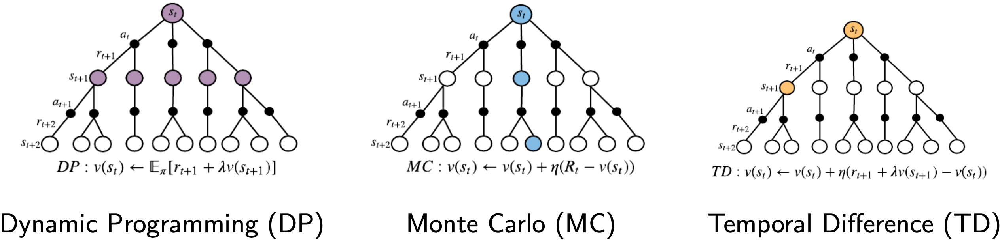

# Lecture 2: Planning and Learning

### 1. Preliminaries

### 2. Dynamic Programming
* Policy Iteration
* Value Iteration

### 3. Monte Carlo Methods
* MC Policy Evaluation (Prediction)
* MC Policy Optimization (Control)

### 4. Temporal Difference Learning
* TD Prediction
* TD Control: SARSA

