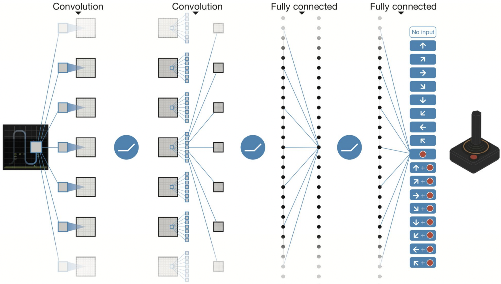
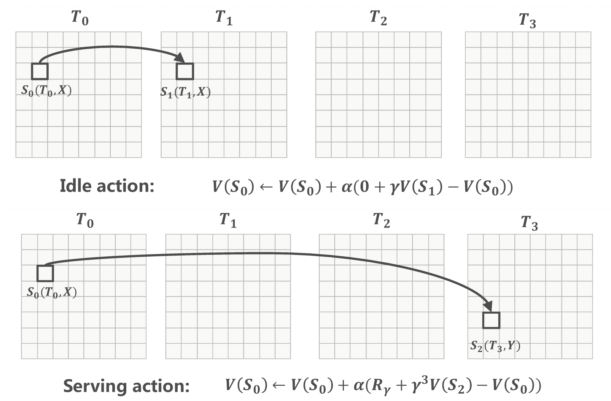

# Lecture 3: Q-Learning and Beyond

### 1. Tabular Q-Learning

### 2. Fitted Q-Iteration

### 3. Case Study I: Deep Q-Network (DQN) in Atari

Taken from Minh et al. (2015, *Nature*)

### 4. Case Study II: TD Learning in Ridesharing Platforms

Taken from Xu et al. (2018, *KDD*)
