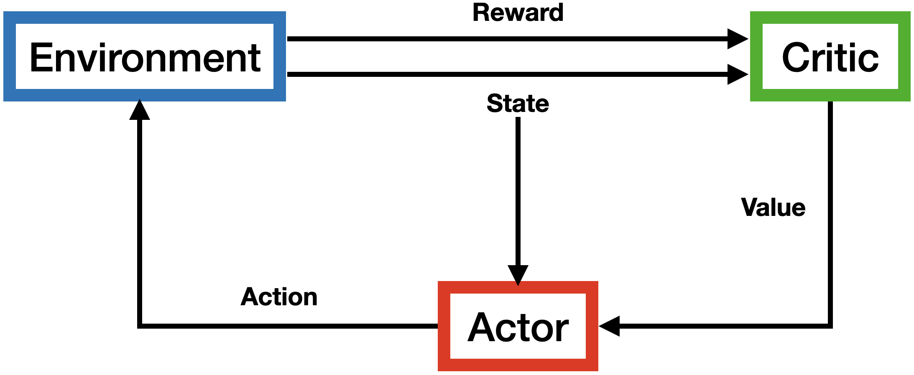
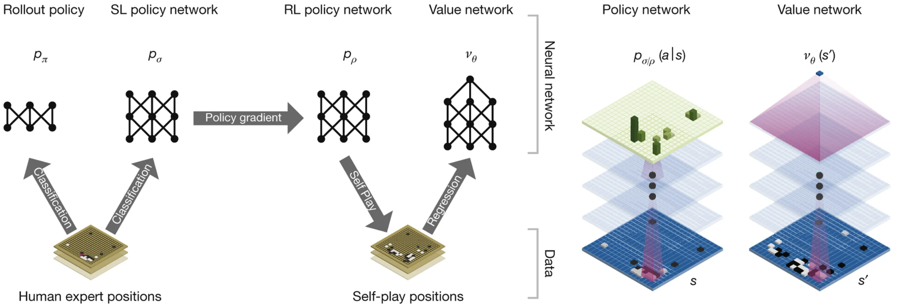

# Lecture 4: Policy- and Model-based Learning

### 1. Policy-based Learning
* Introduction to Policy-based Learning
* Policy Gradient Theorem
* REINFORCE and Actor Critic Algorithms
* Advantage Actor Critic

### 2. Model-based Learning
* Introduction to Model-based Learning
* Model-based Methods
* Mastering the Game of Go

Taken from Silver et al. (2017, *Nature*)
