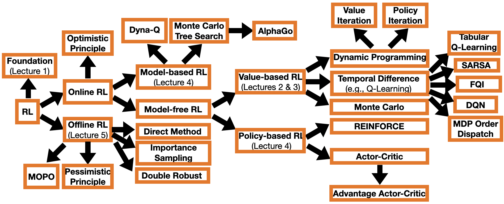

# Reinforcement Learning Short Course

This short course is made based on materials in [Sutton and Barto (2018)](http://incompleteideas.net/book/RLbook2020.pdf), [Puterman (1994)](https://onlinelibrary.wiley.com/doi/book/10.1002/9780470316887), [DeepMind & UCL RL lecture series](https://www.deepmind.com/learning-resources/introduction-to-reinforcement-learning-with-david-silver) and some research papers. It was recently used in HKU and ECNU. A longer version of the course is available in [LSE](https://www.lse.ac.uk/resources/calendar2021-2022/courseGuides/ST/2021_ST455.htm). 

Slides and other materials are available in a separate folder for each lecture.

### Lectures

1. Foundations of Reinforcement Learning
2. Planning and Learning
3. Q-Learning and Beyond
4. Policy- and Model-based Learning
5. Offline Reinforcement Learning

### Roadmap

Shield: [![CC BY-SA 4.0][cc-by-sa-shield]][cc-by-sa]

This work is licensed under a
[Creative Commons Attribution-ShareAlike 4.0 International License][cc-by-sa].

[![CC BY-SA 4.0][cc-by-sa-image]][cc-by-sa]

[cc-by-sa]: http://creativecommons.org/licenses/by-sa/4.0/
[cc-by-sa-image]: https://licensebuttons.net/l/by-sa/4.0/88x31.png
[cc-by-sa-shield]: https://img.shields.io/badge/License-CC%20BY--SA%204.0-lightgrey.svg
